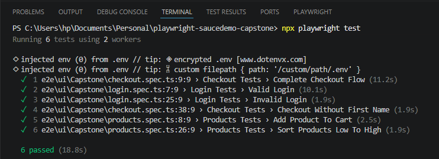
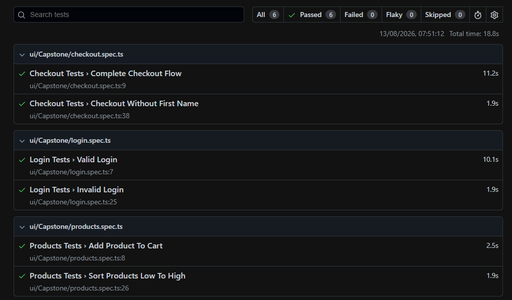

# Playwright Saucedemo Capstone

## Project Overview

This project is a Playwright end-to-end automation test suite developed for the TestarsQuarter Playwright.JS Cohort Capstone Project.

The framework validates critical user journeys on the SauceDemo application, including authentication, product interactions, product sorting, cart management, and checkout functionality.

**Application Under Test (AUT):**

https://www.saucedemo.com

---

## Tech Stack

* Playwright
* TypeScript
* Node.js
* GitHub Actions (CI/CD)
* Page Object Model (POM)

---

## Project Structure

```text
playwright-saucedemo-capstone
│
├── .github
│   └── workflows
│       └── playwright.yml
│
├── e2e
│   └── ui
│       └── Capstone
│           ├── login.spec.ts
│           ├── products.spec.ts
│           └── checkout.spec.ts
│
├── pages
│   ├── LoginPage.ts
│   ├── InventoryPage.ts
│   └── CheckoutPage.ts
│
├── utils
│   └── test-data
│       └── users.json
│
├── playwright.config.ts
├── .env.example
├── README.md
└── .gitignore
```

---

## Test Scenarios Covered

### Login Tests

* Valid Login
* Invalid Login

### Product Tests

* Add Product To Cart
* Sort Products Low To High

### Checkout Tests

* Complete Checkout Flow
* Checkout Validation (Missing First Name)

---

## Installation

Clone the repository:

```bash
git clone https://github.com/Jevmis/playwright-saucedemo-capstone.git
```

Navigate into the project:

```bash
cd playwright-saucedemo-capstone
```

Install dependencies:

```bash
npm install
```

Install Playwright browsers:

```bash
npx playwright install
```

---

## Environment Variables

Create a `.env` file in the project root.

Example:

```env
BASE_URL=https://www.saucedemo.com

STANDARD_USERNAME=standard_user
STANDARD_PASSWORD=secret_sauce

INVALID_USERNAME=locked_out_user
INVALID_PASSWORD=wrong_password
```

Alternatively, copy the provided `.env.example` file and update the values as needed.

---

## Running Tests

Run all tests:

```bash
npx playwright test
```

Run login tests only:

```bash
npx playwright test login.spec.ts
```

Run product tests only:

```bash
npx playwright test products.spec.ts
```

Run checkout tests only:

```bash
npx playwright test checkout.spec.ts
```

Run tests in headed mode:

```bash
npx playwright test --headed
```

---

## Test Reports

Generate and open the Playwright HTML report:

```bash
npx playwright show-report
```

Screenshots, traces, and execution reports are automatically generated for failed test executions.

---

## Test Execution Evidence

### Test Summary



### Playwright HTML Report



---

## CI/CD

GitHub Actions is configured to automatically:

* Install project dependencies
* Install Playwright browsers
* Execute the test suite
* Generate and upload Playwright reports

The workflow runs automatically on:

* Push events
* Pull Requests

---

## Design Pattern

This framework follows the **Page Object Model (POM)** design pattern to improve maintainability, readability, scalability, and reusability of test code.

---

## Author

**Michael Jackson Ndueso**

QA Engineer | Computer Engineer

QA Engineer | Computer Engineer

🌐 Portfolio: https://michaeljndueso.is-a.dev

💼 LinkedIn: https://linkedin.com/in/michaeljndueso

💻 GitHub: https://github.com/Jevmis

📧 Email: Michaeljndueso@outlook.com

---

**Playwright.JS Cohort 2026 – TestarsQuarter Initiative**
